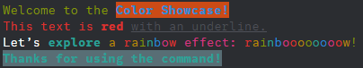

<a id="readme-top"></a>

<!-- PROJECT SHIELDS -->
[![Forks][forks-shield]][forks-url]
[![Stargazers][stars-shield]][stars-url]
[![Issues][issues-shield]][issues-url]
[![MIT License][license-shield]][license-url]


<!-- PROJECT LOGO -->
<br />
<div align="center">
  <a href="https://github.com/lukazbaum/discord-bot-handler">
    
  </a>

<h3 align="center">Discord Bot Handler</h3>

  <p align="center">
    An awesome Discord Bot Handler with advanced features to jumpstart your projects!
    <br />
    <a href="https://github.com/lukazbaum/discord-bot-handler?tab=readme-ov-file#documentation"><strong>Explore the docs »</strong></a>
    <br />
    <br />
    <a href="https://github.com/lukazbaum/discord-bot-handler/tree/master/src">View Examples</a>
    ·
    <a href="https://github.com/lukazbaum/discord-bot-handler/issues/new?assignees=&labels=bug&projects=&template=BUG_REPORT.md&title=%5BBUG%5D">Report Bug</a>
    ·
    <a href="https://github.com/lukazbaum/discord-bot-handler/issues/new?assignees=&labels=enhancement&projects=&template=FEATURE_REQUEST.md&title=">Request Feature</a>
  </p>
</div>


<!-- TABLE OF CONTENTS -->
<details>
  <summary>Table of Contents</summary>
  <ol>
    <li>
      <a href="#about-the-project">About The Project</a>
      <ul>
        <li><a href="#features">Features</a></li>
        <li><a href="#why-this-handler">Why This Handler?</a></li>
      </ul>
    </li>
    <li>
      <a href="#getting-started">Getting Started</a>
      <ul>
        <li><a href="#prerequisites">Prerequisites</a></li>
        <li><a href="#installation">Installation</a></li>
      </ul>
    </li>
    <li>
      <a href="#documentation">Documentation</a>
      <ul>
        <li><a href="#command-arguments">Command Arguments</a></li>
        <li><a href="#commands">Commands</a></li>
        <li><a href="#components">Components</a></li>
        <li><a href="#embed-paginator">Embed Paginator</a></li>
        <li><a href="#colored-message-builder">Colored Message Builder</a></li>
      </ul>
    </li>
    <li><a href="#roadmap">Roadmap</a></li>
    <li><a href="#contributing">Contributing</a></li>
    <li><a href="#license">License</a></li>
  </ol>
</details>


# About The Project

This Discord Bot Handler is built to simplify the creation of powerful bots while maintaining a clean and organized codebase. With built-in support for modern Discord features like slash commands, buttons, and modals, it eliminates the hassle of handling boilerplate code. Whether you're crafting a small bot for personal use or a large-scale application, this handler lets you focus on adding the features that matter most.

## Features

This handler includes everything you need to create a powerful Discord Bot:

- **Command Handling**:
  - Support for **Slash Commands**, **Context Menus**, and **Autocomplete**.
  - Classic **Prefix Commands** for users who prefer traditional interaction.
  - Advanced argument features, including **cooldowns**, usage restrictions, and more.

- **Component Handling**:
  - Seamless integration with Discord **Buttons**, **Select Menus**, and **Modals** for interactive component elements.

- **Event Handling**:
  - Automatically manages event listeners.

- **Automatic Intents**:
  - No need to manually specify Gateway Intents—the handler determines and applies them automatically.

- **Reloadable Commands, Events, and Components**:
    - Commands, Events, and Components can be dynamically reloaded or added during runtime without the need for a bot restart.

- **Embed Pagination**:
  - Easy-to-use utilities for creating paginated embeds, perfect for displaying large datasets or navigation.

- **Colored Message Builder**:
  - A customizable message builder to create visually appealing messages.


## Why This Handler?

- **Simplicity**: Abstracts away the repetitive tasks involved in bot development.
- **Flexibility**: Designed to support various bot types, from utility-focused to entertainment-driven.
- **Scalability**: Modular architecture makes it easy to extend and maintain as your bot grows.
- **Community-Driven**: Contributions and feedback are welcome to help make this the ultimate bot handler.


<p align="right">(<a href="#readme-top">back to top</a>)</p>


# Getting Started

Follow these steps to install and set up the Discord Bot Handler.

## Prerequisites

This project is optimized for use with [Bun](https://bun.sh), a fast JavaScript runtime. While you can use npm, we highly recommend using Bun for better performance. Starting the bot with Bun can be up to **5 times faster** compared to using npm.

Before you begin, ensure you have the following:
- **Node.js**
- A **Discord Bot Application** (see [Discord's developer portal](https://discord.com/developers/applications) to create a bot)
- Ensure the Discord Bot is configured with the `MESSAGE CONTENT` Privileged Gateway Intent enabled.
  - You can enable this in the **Bot** section under **Settings** on the [Discord's developer portal](https://discord.com/developers/applications).
  - **Note:** If you prefer not to use this intent, you can disable it in the project's configuration file.
- Make sure the bot invite link includes the `applications.commands` scope to enable slash commands. Update the link in the **OAuth2** section on the [Discord's developer portal](https://discord.com/developers/applications) if needed.

### Installing Bun

To install Bun, run the following command in your terminal:

```sh
  # Windows:
  powershell -c "irm bun.sh/install.ps1 | iex"
  
  # Linux:
  curl -fsSL https://bun.sh/install | bash
  ```

### Alternatively, with npm
If you prefer to use npm or something else, ensure it’s up-to-date:

* npm
  ```sh
  npm install npm@latest -g
  ```

## Installation

1. Clone the repository
   ```sh
   git clone https://github.com/lukazbaum/discord-bot-handler
   ```
2. Install dependencies
   ```sh
   bun install
   # or
   npm install
   ```
3. Configure environment variables

   Rename `.env.example` to `.env` in the project root and fill in your bot's details:
   ```env
   CLIENT_TOKEN=your_discord_bot_token
   CLIENT_ID=your_discord_client_id
   GUILD_ID=your_discord_guild_id
   ```
   Additionally, set your **Discord ID** (`ownerId`) in the config file to ensure that owner-specific commands work correctly.
4. Run the bot
   ```sh
   bun start
   # or
   npm run start:node
   ```
5. Build the bot (optional)

   To build the bot for production:
    ```sh
   bun build
   # or
   npm run build
   ```

<p align="right">(<a href="#readme-top">back to top</a>)</p>


# Documentation

Explore the documentation for in-depth insights on using and optimizing the Discord Bot Handler in your projects.

## Command Arguments
The following table explains the optional configuration arguments available for commands in your bot. Examples of how to use these arguments can be found within the bot's codebase.

| **Argument**                 | **Type**   | **Description**                                                                                    |
|------------------------------|------------|----------------------------------------------------------------------------------------------------|
| `userCooldown?`              | `number`   | Cooldown (in seconds) for each user.                                                               |
| `guildCooldown?`             | `number`   | Cooldown (in seconds) for all users in a guild.                                                    |
| `globalCooldown?`            | `number`   | Cooldown (in seconds) for all users globally.                                                      |
| `allowedUsers?`              | `string[]` | List of user IDs explicitly allowed to use the command.                                            |
| `blockedUsers?`              | `string[]` | List of user IDs explicitly blocked from using the command.                                        |
| `optionalAllowedUsers?`      | `string[]` | List of optional user IDs where the command is conditionally allowed.¹                             |
| `allowedChannels?`           | `string[]` | List of channel IDs where the command is allowed.                                                  |
| `blockedChannels?`           | `string[]` | List of channel IDs where the command is blocked.                                                  |
| `optionalAllowedChannels?`   | `string[]` | List of optional channel IDs where the command is conditionally allowed.¹                          |
| `allowedCategories?`         | `string[]` | List of category IDs where the command is allowed.                                                 |
| `blockedCategories?`         | `string[]` | List of category IDs where the command is blocked.                                                 |
| `optionalAllowedCategories?` | `string[]` | List of optional category IDs where the command is conditionally allowed.¹                         |
| `allowedGuilds?`             | `string[]` | List of guild IDs where the command is allowed.                                                    |
| `blockedGuilds?`             | `string[]` | List of guild IDs where the command is blocked.                                                    |
| `optionalAllowedGuilds?`     | `string[]` | List of optional guild IDs where the command is conditionally allowed.¹                            |
| `allowedRoles?`              | `string[]` | List of role IDs that can use the command.                                                         |
| `blockedRoles?`              | `string[]` | List of role IDs that are blocked from using the command.                                          |
| `optionalAllowedRoles?`      | `string[]` | List of optional role IDs where the command is conditionally allowed.¹                             |
| `restrictedToOwner?`         | `boolean`  | Restricts the command to the bot owner only.                                                       |
| `restrictedToNSFW?`          | `boolean`  | Restricts the command to NSFW channels only.                                                       |
| `isDisabled?`                | `boolean`  | Disables the command entirely, making it unavailable for use.                                      |
| `logUsage?`                  | `boolean`  | Logs the usage of a command to the channel specified in the config.                                |
| `aliases?`                   | `string[]` | List of alternate names for the command that can be used to invoke it. *(Only for PrefixCommands)* |

**¹Note on Optional Whitelists**: When using optional whitelists, the command will be allowed to execute if any one of the optional whitelist conditions is met.


## Commands

This bot supports several types of commands, including Slash Commands, Context Menus, Prefix Commands, and Autocomplete Commands.

<details>
<summary><b>Slash Commands</b></summary> You can find more examples at: <a href="https://github.com/lukazbaum/discord-bot-handler/tree/master/src/commands/slash">commands/slash</a>

```ts
export default new SlashCommand({
  registerType: RegisterType.Guild,

  data: new SlashCommandBuilder()
    .setName('ping')
    .setDescription('Replies with pong!'),

  async execute(interaction: ChatInputCommandInteraction): Promise<void> {
    await interaction.reply({ content: "Pong!" });
  },
});
  ```
- **`registerType: RegisterType`**  
  Specifies where the command should be registered:
  - **`.Guild`**: Registers the command for a specific server (guild).
  - **`.Global`**: Registers the command for all servers where the bot is present.
</details> 

<details>
<summary><b>Context Menus</b></summary> You can find more examples at: <a href="https://github.com/lukazbaum/discord-bot-handler/tree/master/src/commands/context">commands/context</a>

```ts
export default new ContextMenu({
  registerType: RegisterType.Guild,

  data: new ContextMenuCommandBuilder()
    .setName('Get Message ID')
    .setType(ApplicationCommandType.Message as ContextMenuCommandType),

  async execute(interaction: ContextMenuCommandInteraction): Promise<void> {
    await interaction.reply({ content: `Message ID: ${interaction.targetId}`, ephemeral: true });
  },
});
  ```
- **`registerType: RegisterType`**  
  Specifies where the command should be registered:
  - **`.Guild`**: Registers the command for a specific server (guild).
  - **`.Global`**: Registers the command for all servers where the bot is present.
</details>

<details>
<summary><b>Prefix Commands</b></summary> You can find more examples at: <a href="https://github.com/lukazbaum/discord-bot-handler/tree/master/src/commands/prefix">commands/prefix</a>

```ts
export default new PrefixCommand({
  name: 'ping',
  aliases: ['peng'],
  userCooldown: 10,

  async execute(message: Message): Promise<any> {
    await message.reply('Pong!');
  },
});
  ```
</details>

<details>
<summary><b>Autocomplete Commands</b></summary> You can find this example at: <a href="https://github.com/lukazbaum/discord-bot-handler/tree/master/src/commands/slash/showcase/autocomplete.ts">commands/slash/showcase/autocomplete.ts</a>

```ts
export default new SlashCommand({
  registerType: RegisterType.Guild,
  
  data: new SlashCommandBuilder()
    .setName('autocomplete')
    .setDescription('Explore the autocomplete feature!')
    .addStringOption((option) =>
      option
        .setName('topic')
        .setDescription('Choose a topic from the suggestions')
        .setAutocomplete(true)
        .setRequired(true),
    ),

  async autocomplete(interaction: AutocompleteInteraction): Promise<void> {
    const focusedValue: string = interaction.options.getFocused().toLowerCase();
    const choices: string[] = [
      'Getting Started with Discord.js',
      'Building Slash Commands',
      'Understanding Permissions',
      'Working with Autocomplete',
      'Creating Buttons and Select Menus',
      'Error Handling in Discord Bots',
    ];

    const filtered: string[] = choices.filter((choice) => choice.toLowerCase().includes(focusedValue));
    await interaction.respond(filtered.map((choice) => ({ name: choice, value: choice })));
  },

  async execute(interaction: ChatInputCommandInteraction): Promise<void> {
    const selectedTopic: string = interaction.options.getString('topic', true);
    await interaction.reply({
      content: `You selected: **${selectedTopic}**`,
    });
  },
});
  ```
- **`registerType: RegisterType`**  
  Specifies where the command should be registered:
  - **`.Guild`**: Registers the command for a specific server (guild).
  - **`.Global`**: Registers the command for all servers where the bot is present.
</details> 

<p align="right">(<a href="#readme-top">back to top</a>)</p>

## Components

This bot supports all types of components, including Buttons, Select Menus, and Modals.

### Component Arguments

| Property    | Type      | Description                                  |
|-------------|-----------|----------------------------------------------|
| `customId`  | `string`  | A unique identifier for the component.       |
| `disabled?` | `boolean` | Indicates whether the component is disabled. |

### Unique IDs

Unique IDs allow for more dynamic interaction handling by appending specific identifiers to the `customId` of a component. These IDs are separated from the base identifier by a colon (`:`).

#### Creating a Button with a Unique ID
```ts
.setCustomId('buttons:confirm')
```

#### Handling the Button in the Component File
```ts
async execute(interaction: ButtonInteraction, uniqueId: string | null): Promise<void> {
  await interaction.reply({
    content: `You have pressed the **${uniqueId}** button.`,
    ephemeral: true,
  });
}
```

In this example
- `buttons` is the base identifier (`customId`) used to recognize the component.
- `confirm` is the unique identifier (`uniqueId`) that provides additional context or differentiation for the interaction.

If no unique ID is required, you can use just the base identifier, such as `buttons`.


### Component Examples

<details>
<summary><b>Buttons</b></summary> You can find this example at: <a href="https://github.com/lukazbaum/discord-bot-handler/tree/master/src/components/buttons/buttons.ts">components/buttons/buttons.ts</a>

#### Creating the Buttons
```ts
const row = new ActionRowBuilder<ButtonBuilder>().addComponents(
  new ButtonBuilder()
    .setCustomId('buttons:confirm')
    .setLabel('Confirm')
    .setStyle(ButtonStyle.Success),
  new ButtonBuilder()
    .setCustomId('buttons:cancel')
    .setLabel('Cancel')
    .setStyle(ButtonStyle.Secondary),
  new ButtonBuilder()
    .setCustomId('buttons:info')
    .setLabel('More Info')
    .setStyle(ButtonStyle.Primary),
);
  ```

#### Handling the Buttons
```ts
export default new Button({
  customId: 'buttons',

  async execute(interaction: ButtonInteraction, uniqueId: string | null): Promise<void> {
    await interaction.reply({
      content: `You have pressed the **${uniqueId}** button.`,
      ephemeral: true,
    });
  },
});
```
</details> 

<details>
<summary><b>Select Menus</b></summary> You can find this example at: <a href="https://github.com/lukazbaum/discord-bot-handler/tree/master/src/components/selectMenus/select.ts">components/selectMenus/select.ts</a>

#### Creating the Select Menu
```ts
const menu: StringSelectMenuBuilder = new StringSelectMenuBuilder()
  .setCustomId('selectMenu')
  .setPlaceholder('Choose wisely...')
  .setMinValues(1)
  .setMaxValues(1)
  .addOptions(
    {
      label: 'Cats',
      description: 'Choose this if you like cats',
      value: 'cats',
      emoji: '🐱',
    },
    {
      label: 'Dogs',
      description: 'Choose this if you like dogs',
      value: 'dogs',
      emoji: '🐶',
    },
    {
      label: 'Birds',
      description: 'Choose this if you like birds',
      value: 'birds',
      emoji: '🐦',
    },
  );
  ```

#### Handling the Select Menu
```ts
export default new SelectMenu({
  customId: 'selectMenu',

  async execute(interaction: AnySelectMenuInteraction, values: string[], uniqueIds: (string | null)[]): Promise<void> {
    const choice: string = values[0];

    const responses: Record<string, string> = {
      cats: 'You chose cats! 🐱',
      dogs: 'You chose dogs! 🐶',
      birds: 'You chose birds! 🐦',
    };

    await interaction.reply({ content: responses[choice] });
  },
});
```
</details> 

<details>
<summary><b>Modals</b></summary> You can find this example at: <a href="https://github.com/lukazbaum/discord-bot-handler/tree/master/src/components/modals/askModal.ts">components/modals/askModal.ts</a>

#### Creating the Modal
```ts
const modal: ModalBuilder = new ModalBuilder()
  .setCustomId('askModal')
  .setTitle('Tell us about yourself!');

const colorInput: TextInputBuilder = new TextInputBuilder()
  .setCustomId('favoriteColor')
  .setLabel("What's your favorite color?")
  .setPlaceholder('e.g., Blue')
  .setStyle(TextInputStyle.Short);

const hobbiesInput: TextInputBuilder = new TextInputBuilder()
  .setCustomId('hobbies')
  .setLabel("What's one of your favorite hobbies?")
  .setPlaceholder('e.g., Reading books')
  .setStyle(TextInputStyle.Paragraph);

const colorRow = new ActionRowBuilder<TextInputBuilder>().addComponents(colorInput);
const hobbiesRow = new ActionRowBuilder<TextInputBuilder>().addComponents(hobbiesInput);

modal.addComponents(colorRow, hobbiesRow);
  ```

#### Handling the Modal
```ts
export default new Modal({
  customId: 'askModal',

  async execute(interaction: ModalSubmitInteraction, fields: ModalSubmitFields): Promise<void> {
    const favoriteColor: string = fields.getTextInputValue('favoriteColor');
    const hobbies: string = fields.getTextInputValue('hobbies');

    await interaction.reply({
      content: `Your favorite color is **${favoriteColor}** and you enjoy **${hobbies}**!`,
      ephemeral: true,
    });
  },
});
```
</details>

<p align="right">(<a href="#readme-top">back to top</a>)</p>

## Embed Paginator

The `EmbedPaginator` is a powerful utility for displaying paginated embeds with interactive buttons for navigating between pages. This is particularly useful for large sets of data or information, allowing users to browse through pages of content easily.

### Paginator Settings

| **Field**                  | **Type**          | **Description**                                                                      |
|----------------------------|-------------------|--------------------------------------------------------------------------------------|
| `pages`                    | `EmbedBuilder[]`  | An array of `EmbedBuilder` instances representing the pages of content to paginate.  |
| `timeout`                  | `number`          | The time (in seconds) before the paginator buttons become inactive.                  |
| `buttons?`                 | `ButtonPartial[]` | Custom settings for paginator buttons. Defines button type, label, style, and emoji. |
| `showButtonsAfterTimeout?` | `boolean`         | Whether to keep the paginator buttons visible after the timeout period.              |
| `hideFirstLastButtons?`    | `boolean`         | Whether to hide the "First" and "Last" buttons in the paginator.                     |
| `loopPages?`               | `boolean`         | Whether to loop back to the first page after the last page is reached.               |
| `autoPageDisplay?`         | `boolean`         | Whether to display the current page number in the footer of the embed.               |
| `restrictToAuthor?`        | `boolean`         | Restricts interactions to the user who triggered the paginator. Default is `true`.   |

**ButtonPartial:**
- `type`: Specifies the type of the button (`PaginatorButtonType`).
- `label?`: The label of the button.
- `style?`: The style of the button (`ButtonStyle`).
- `emoji?`: The emoji to display on the button.

### PaginatorSendOptions

| **Field**    | **Type**                   | **Description**                                                                                             |
|--------------|----------------------------|-------------------------------------------------------------------------------------------------------------|
| `context`    | `Interaction` or `Message` | The `interaction` or `message` instance from the command.                                                   |
| `ephemeral?` | `boolean`                  | Whether the paginator message should be ephemeral (only visible to the user who triggered the interaction). |
| `followUp?`  | `boolean`                  | Whether to send the paginator as a follow-up message (useful if replying to an initial interaction).        |
| `content?`   | `string`                   | The content to display alongside the embed in the paginator message.                                        |


### Usage Example:
```ts
const pages: EmbedBuilder[] = [
  new EmbedBuilder()
    .setTitle('Welcome to the Paginator')
    .setDescription('This is **Page 1** of the paginator.')
    .setColor(Colors.Blue),
  new EmbedBuilder()
    .setTitle('Page 2')
    .setDescription('Here is some more information on **Page 2**.')
    .setColor(Colors.Green),
  new EmbedBuilder().setTitle('Page 3')
    .setDescription('Finally, this is **Page 3**. Enjoy!')
    .setColor(Colors.Red),
];

const paginator: EmbedPaginator = new EmbedPaginator({
  pages,
  timeout: 60,
  autoPageDisplay: true,
});

await paginator.send({ context: interaction });
```

<p align="right">(<a href="#readme-top">back to top</a>)</p>

## Colored Message Builder

The `ColoredMessageBuilder` is designed to enhance the visual appeal of your Discord bot's messages. It allows for various text formatting options, including text color, background color, and styling.

### Example Usage:
```ts
const coloredMessage: string = new ColoredMessageBuilder()
  .add('Welcome to the ', Color.Green)
  .add('Color Showcase!', Color.Blue, BackgroundColor.Orange, Format.Bold)
  .addNewLine()
  .add('This text is ', Color.Red)
  .add('red ', Color.Red, BackgroundColor.None, Format.Bold)
  .add('with an underline.', Color.Gray, BackgroundColor.None, Format.Underline)
  .addNewLine()
  .add('Let’s ', Color.White)
  .add('explore ', Color.Cyan, BackgroundColor.None, Format.Bold)
  .add('a ', Color.Yellow)
  .addRainbow('rainbow ')
  .add('effect: ', Color.Pink)
  .addRainbow('rainboooooooow!', Format.Normal)
  .addNewLine()
  .add('Thanks for using the command!', Color.Cyan, BackgroundColor.MarbleBlue, Format.Bold)
  .build();

await interaction.reply({ content: coloredMessage });
```

### Output:

<div align="center">
    
</div>

<p align="right">(<a href="#readme-top">back to top</a>)</p>


# Roadmap

- [x] Enhance the Embed Paginator to support non-interaction-based commands.
- [x] Add a command argument which logs command usage.
- [ ] Enhance the Embed Paginator to support custom components.
- [ ] Increase customization options for denied command responses.
- [ ] Add command-line tools to quickly create commands, components and events with predefined templates.
- [ ] Implement a plugin system, enabling features like a ticket system to be seamlessly integrated into the project with a single line of code.

<p align="right">(<a href="#readme-top">back to top</a>)</p>


# Contributing

Contributions are what make the open source community such an amazing place to learn, inspire, and create. Any contributions you make are **greatly appreciated**.

If you have a suggestion that would make this better, please fork the repo and create a pull request. You can also simply open an issue with the tag "enhancement".
Don't forget to give the project a star! Thanks again!

1. Fork the Project
2. Create your Feature Branch (`git checkout -b feature/AmazingFeature`)
3. Commit your Changes (`git commit -m 'Add some AmazingFeature'`)
4. Push to the Branch (`git push origin feature/AmazingFeature`)
5. Open a Pull Request

<p align="right">(<a href="#readme-top">back to top</a>)</p>


# License

Distributed under the MIT License. See [LICENSE](LICENSE) for more information.

<p align="right">(<a href="#readme-top">back to top</a>)</p>


<!-- MARKDOWN LINKS -->
[forks-shield]: https://img.shields.io/github/forks/lukazbaum/discord-bot-handler.svg?style=for-the-badge
[forks-url]: https://github.com/lukazbaum/discord-bot-handler/network/members
[stars-shield]: https://img.shields.io/github/stars/lukazbaum/discord-bot-handler.svg?style=for-the-badge
[stars-url]: https://github.com/lukazbaum/discord-bot-handler/stargazers
[issues-shield]: https://img.shields.io/github/issues/lukazbaum/discord-bot-handler.svg?style=for-the-badge
[issues-url]: https://github.com/lukazbaum/discord-bot-handler/issues
[license-shield]: https://img.shields.io/github/license/lukazbaum/discord-bot-handler.svg?style=for-the-badge
[license-url]: https://github.com/lukazbaum/discord-bot-handler/blob/master/LICENSE.txt

<!-- Thanks to othneildrew for this amazing template (https://github.com/othneildrew/Best-README-Template) -->
